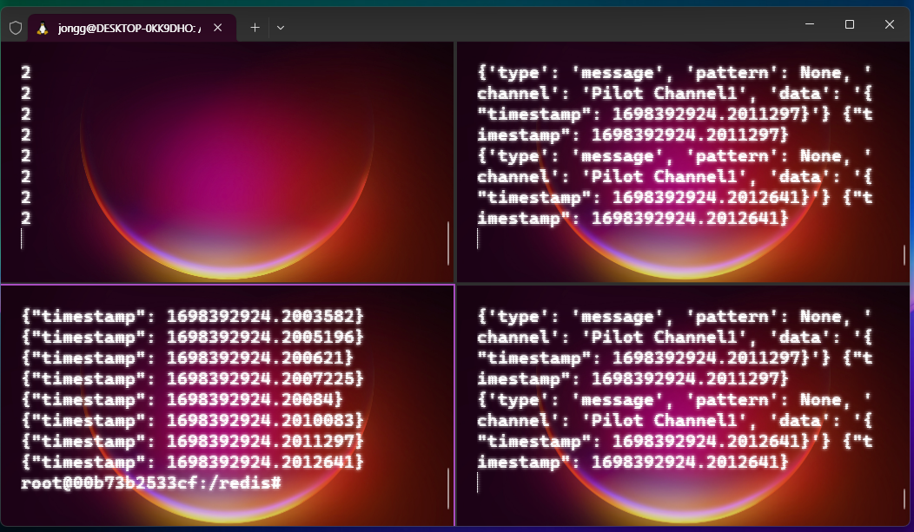

# Redis pilot
> Message Queue로써의 Redis

# venv 실행
```shell
source ~/.virtualenvs/Pilot/redis/bin/activate
```

# [Python으로 Redis Message Queue 실습하기](https://www.notion.so/jonggurl96/Redis-3004d4e36a6248b6b18a854ccf1acb08?pvs=4#3fd5ef8c1ec54407a498553d2ba6e9c0)

# RabbitMQ 대신 redis 적용하기
## subscribe
구독자가 채널을 구독. 없으면 생성

## publish
publisher가 센서값을 받으면 구독자에 전송

- producer.py
  > 센서 값을 읽어서 Redis에 저장
- broker.py
  > Redis에 정보가 저장되면 꺼내서 전송
- consumer.py
  > 전송받은 데이터 출력

# 실험 순서
## Redis 실행
Docker에서 직접 실행하되 아래 코드로 서버 생성
```shell
redis-server --port 6380

# ip 확인용 코드
apt-get update
apt-get install net-tools
ifconfig
```

## broker.py 실행
```shell
docker run --name broker -v /mnt/c/Users/jongg/PycharmProjects/Pilot/redis:/redis -it python:3.8.10 /bin/bash
cd /redis
pip install redis pyyaml

# 동일한 환경 재사용을 위해 이미지화
docker commit broker redis-python-image

# broker.py 구동
python broker.py
```

## consumer.py, producer.py 실행
원하는 수의 터미널 열고 name 값만 바꿔가면서 실행
```shell
docker run --name consumer1 -v /mnt/c/Users/jongg/PycharmProjects/Pilot/redis:/redis -it redis-python-image /bin/bash
cd /redis

python consumer.py
python producer.py
```

## 결과 화면


|             |             |
|:------------|:------------|
| broker.py   | consumer.py |
| producer.py | consumer.py |

# [MQTT 연동하기](mqtt)
